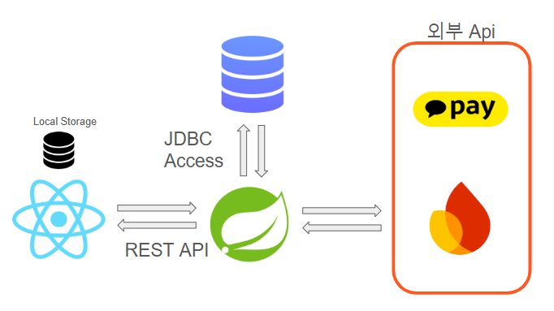
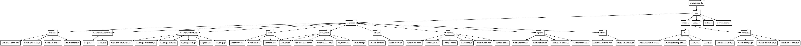
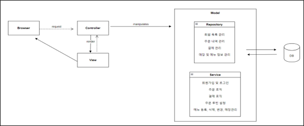

# Project Title

**IrumOrder**

---

## Project Scope

서울시립대학교 컴퓨터과학부 2024년 소프트웨어공학 프로젝트로, Software Development Life-Cycle을 기반으로 객체지향 소프트웨어공학 방법론을 적용하여 교내 카페 모바일 주문을 도와주는 모바일 앱 개발.

---

## Project Duration

2024년 2학기

---

## Project Values/Motivations

대학교 교내 카페에서 학생들과 교직원이 비대면으로 빠르고 편리하게 주문 및 결제할 수 있도록 지원하는 것을 목표로 합니다. 이를 통해 대기 시간을 줄이고 카페 운영의 효율성을 높이며, 사용자 맞춤형 픽업 시간 예약 기능으로 사용자 편의성을 극대화하고자 합니다. 특히 수업 시간 전, 점심시간 등 붐비는 시간에 주문과 픽업이 원활하게 이루어지도록 하여 학생들이 수업 사이 10분 간의 짧은 쉬는 시간을 보다 효율적으로 활용할 수 있도록 설계되었습니다.

 - 원하는 시간대를 선택하여 교내 카페의 붐비는 시간에 맞춰 픽업 예약 기능
 - 같은 메뉴를 설정하고 원하는 시간대에 비대면 오더를 할 수 있도록 알림을 받을 수 있는 맞춤형 루틴 설정 기능

이러한 목표로 학생들의 카페 주문 편리성을 높은 웹앱을 개발하였습니다.

- 진행 기간: 2024.09. ~ 2024.12.(4개월)
- 팀 구성 및 담당 역할: 총 6명 (프론트엔드 3, **백엔드 3**)
  
---

## Highlighted Features

- **픽업 예약**: 메뉴 선택, 주문, 픽업 시간 예약을 간편히 수행.
- **주문 루틴 설정**: 반복적인 주문에 대해 요일, 시간별 알림을 제공해 사용자 경험 최적화.
- **알림 기능**: 주문 상태 변경, 픽업 준비 완료 및 실시간 푸시 알림 제공.

---

## 나의 역할 및 구현 내용

- **유저의 주문 저장 및 조회**
    - 유저가 선택한 메뉴 및 옵션을 기반으로 주문 정보 생성하고 DB에 저장
    - 유저별, 상태별 주문 내역 필터링하여 조회 가능 (e.g. 조리완료/ 픽업완료 등)
- **루틴 기반 알림 기능(Scheduler + Event 기반)**
    - 사용자가 설정한 루틴(요일, 시간, 메뉴)을 기반으로 알림 스케줄 설정
    - Spring Scheduler가 매초마다 DB의 루틴 정보 검사 후 일치하는 루틴 감지되면 알림 이벤트 발생
    - ApplicationEventPublisher와 Firebase Cloud Messaging API를 통해 유저에게 실시간 푸시 알림 전송
- **주문 상태 변경에 따른 실시간 푸시 알람**
    - 직원이 주문 상태 변경시, 서버에서 FCM API 호출
    - 상태 변경 내용이 사용자에게 실시간으로 푸시 알림으로 전달

---

## High-Level Architecture
### 구성 요소 및 데이터 흐름

1. **Frontend (React)**:
    - React를 사용한 사용자 인터페이스 레이어
    - 사용자의 입력 데이터를 처리하고, REST API를 통해 Backend와 상호작용합니다.
    - Local Storage를 통해 클라이언트 측 데이터를 관리합니다.
    - Feature-based Directory Structure



2. **Backend (Spring Framework)**:
    - Spring Framework 기반으로 구현된 애플리케이션 서버
    - REST API를 통해 Frontend와 통신하며, 데이터 요청 및 응답을 처리합니다.
    - 외부 API와 통신, 데이터베이스와 통신합니다.
    - MVC 구조
   


---

### 데이터 흐름

1. **사용자 요청**:
    - 사용자가 Frontend(React)에서 요청을 보냅니다.
    - REST API를 통해 요청이 Backend(Spring)로 전달됩니다.

2. **Backend 처리**:
    - 요청에 따라 데이터를 데이터베이스에 저장하거나 조회합니다 (JDBC Access).
    - 또는 외부 API(Kakao Pay 등)와 상호작용하여 필요한 결과를 가져옵니다.

3. **응답 반환**:
    - Backend는 처리된 결과를 REST API로 Frontend에 반환합니다.
    - Frontend는 데이터를 사용자에게 표시합니다.

---

### 주요 특징
- **모듈화된 아키텍처**:
    - Frontend와 Backend가 명확히 분리되어 있으며, REST API를 통해 통신합니다.
- **확장성**:
    - 외부 API와의 통합을 통해 다양한 서비스 확장이 가능합니다.
- **유지보수성**:
    - Spring Framework 및 JDBC를 사용하여 코드의 유지보수가 용이합니다.
---

## Tech Stack

- **FrontEnd**: React.js
- **BackEnd**: Spring, MySQL
- **API**: Firebase, KakaoPay

---

## Installation

### FrontEnd
```bash
git clone https://github.com/ej9374/Software-Engineering
cd Software-Engineering/IrumOrder_FrontEnd/irumorder_fe 
npm install
npm install react-router-dom
npm install firebase
npm start
```

### BackEnd

1. **IntelliJ IDE 설치**
2. **JDK 설정**
    - JDK 17 버전으로 프로젝트를 설정.
3. [카카오페이 개발자센터](https://developers.kakaopay.com/) 접속 후 비밀키 발급, `IrumOrder_BackEnd/src/main/resources/application.properties` 의 kakao.pay.secret-key에 발급받은 Secret key(dev) 작성
4. **Gradle 빌드**
    - `build.gradle` 실행:
      ```bash
      ./gradlew build
      ```
5. **Spring Boot 애플리케이션 실행**
    - `IrumOrderApplication` 실행:
      ```bash
      ./gradlew bootRun
      ```


---

### Database

1. **MySQL Workbench 설치**
    - 데이터베이스 관리를 위해 MySQL Workbench를 설치.
2. **DB 초기화**
    - `IrumOrder_DB` 폴더의 SQL 스크립트를 실행해 데이터베이스 초기화.
3. **프로퍼티 파일 수정**
    - `application.properties` 파일에서 다음 항목 수정:
    - `spring.datasource.username`: MySQL 사용자 이름
    - `spring.datasource.password`: MySQL 비밀번호
    - `spring.datasource.url`: MySQL 데이터베이스 URL
4. **IntelliJ와 데이터베이스 연결**
    - IntelliJ에서 MySQL 데이터베이스 연결 설정 완료.
---
### Alarm기능 사용 시
1. **/IrumOrder_Backend/src/main/resources/firebase에 serviceAccount.json 파일을 만든 후, 아래와 같은 형식으로 json 파일 저장**

```json
    {

       "type": "service_account",
    
       "project_id": "irumorder",
    
       "private_key_id": ,
    
       "private_key": ,
    
       "client_email": ,
    
       "client_id": ,
    
       "auth_uri": ,
    
       "token_uri": ,
    
       "auth_provider_x509_cert_url": ,
    
       "client_x509_cert_url": ,
    
       "universe_domain": "googleapis.com"

   }
```

2. **chrome에서 알림 기능을 킨 후 실행**
3. **개발자모드의 콘솔창에서 "FCM Token: " 뒤의 전체 string을 복사해서 TokenEntity 데이터베이스에 저장(혹은 swagger.io에서 FcmController를 이용하여 데이터베이스에 저장)**


---

## Project Deliverables
(링크 업데이트 예정)
### 요구사항 분석 명세서
- [Final Version](artifacts/srs-template-v2.5 wirrten by 이룸오더.docx)

### Architecture & Design Documentation
- [Software Architecture](artifacts/이룸오더 high-level Architecture UML Diagram_v2.3.docx)
- [Software Design](artifacts/Architecture_diagram)
- [UI Design](artifacts/이룸오더 UI 디자인 문서 v1.2.docx)

### Coding Standard
- [Coding Standard](artifacts/Coding Standard, Repository Management and Review Process.pdf)

### API docs
- [api docs](/artifacts/api_docs.pdf)

### bug list
- [bug list](/artifacts/Bug List.xlsx)

---

## Test Cases and Results

- **테스트 위치**: `IrumOrder_BackEnd/src/test/java`
- **테스트 대상**:
    - Controller
    - Service
    - Validator
- **테스트 결과**:
    - 결과 파일은 `IrumOrder/artifacts/testResult`(임시) 폴더에 저장.

---

## Repository Structure

### Backend (`IrumOrder_BackEnd`)

#### Main Codebase
```bash
├─main
│  ├─java
│  │  └─Irumping
│  │      └─IrumOrder
│  │          ├─config             
│  │          ├─controller           
│  │          ├─dto
│  │          ├─entity
│  │          ├─event
│  │          ├─exception
│  │          │  └─CustomExceptions
│  │          ├─listener
│  │          ├─repository
│  │          ├─scheduler
│  │          ├─service
│  │          └─validator
│  └─resources
│      ├─docs
│      └─firebase
└─test
    └─java
        └─Irumping
            └─IrumOrder
                ├─controller
                ├─listener
                ├─scheduler
                ├─service
                └─validator
```
---
- **`config`**
    - 애플리케이션의 설정 파일을 포함합니다.
    - `WebConfig`, `SecurityConfig`, `FirebaseConfig`

- **`controller`**
    - HTTP 요청 및 응답을 처리하는 API 컨트롤러를 포함합니다.
    - `OrderController`, `AuthController` 등

- **`dto`**
    - 계층 간 데이터 전달을 위한 데이터 전송 객체를 정의합니다.
    - `LoginDto`, `OrderRequestDto` 등

- **`entity`**
    - 데이터베이스 테이블과 매핑되는 엔터티 클래스를 정의합니다.
    - `UserEntity`, `OrderEntity` 등

- **`event`**
    - 비동기 프로세스에 사용되는 애플리케이션 이벤트를 정의합니다.
    - `PickUpAlarmEvent`

- **`exception`**
    - 커스텀 예외 및 전역 에러를 처리합니다. 
    - `GlobalExceptionHandler`, `ApiError`
    - **`CustomExceptions`**:
        - 비즈니스 로직에 사용되는 특정 커스텀 예외 클래스.
        - `InvalidInputException`, `PayErrorException` 등

- **`listener`**
    - 애플리케이션 이벤트에 반응하는 이벤트 리스너를 포함합니다.
    - `PickUpAlarmEventListener`

- **`repository`**
    - JPA 또는 기타 데이터베이스 접근 방식을 사용한 데이터베이스 상호작용 인터페이스를 포함합니다.
    - `UserRepository`, `OrderRepository`

- **`scheduler`**
    - 정기적인 백그라운드 작업을 처리합니다.
    - `RoutineAlarmScheduler`

- **`service`**
    - 애플리케이션의 비즈니스 로직을 구현합니다.
    - `AuthService`, `OrderService`

- **`validator`**
    - 사용자 입력 또는 비즈니스 규칙을 검증합니다.
    - `UserValidator`
---


#### `main/resources`

- **`docs`**
    - Swagger YAML 파일과 같은 API 문서를 포함합니다.
    - 예: `swagger-order.yaml`, `swagger-payment.yaml`.

- **`firebase`**
    - Firebase 관련 설정 파일을 포함합니다.
    - 예: `serviceAccount.json`.

---

#### `test/java/Irumping/IrumOrder`

- **`controller`**
    - API 컨트롤러에 대한 테스트 케이스입니다.
    - `OrderControllerTest`, `PayControllerTest` 등

- **`listener`**
    - 이벤트 리스너에 대한 테스트 케이스입니다.
    - `PickUpAlarmEventListenerTest`

- **`scheduler`**
    - 정기 작업 및 백그라운드 작업에 대한 테스트 케이스입니다.
    - `RoutineAlarmSchedulerTest`

- **`service`**
    - 서비스 클래스의 비즈니스 로직에 대한 단위 테스트입니다.
    - `AuthServiceTest`, `OrderServiceTest` 등

- **`validator`**
    - 입력 데이터 처리와 관련된 검증 로직에 대한 테스트 케이스입니다.
    - `UserValidatorTest`

---

### Frontend (`IrumOrder_FrontEnd`)

#### Main Codebase
```bash
irumorder_fe
├── src
│   ├── features
│   │   ├── cart
│   │   │   ├── CartView.css
│   │   │   └── CartView.js
│   │   ├── check
│   │   │   ├── CheckView.css
│   │   │   ├── CheckView.js
│   │   ├── menu
│   │   │   ├── Category.css
│   │   │   ├── Category.js
│   │   │   ├── MenuGrid.css
│   │   │   ├── MenuGrid.js
│   │   │   ├── MenuView.css
│   │   │   └── MenuView.js
│   │   ├── option
│   │   │   ├── OptionView.css
│   │   │   └── OptionView.js
│   │   ├── payment
│   │   │   ├── PickupReserv.css
│   │   │   ├── PickupReserv.js
│   │   │   ├── PayView.css
│   │   │   ├── PayView.js
│   │   │   ├── Paymentcomplete.css
│   │   │   └── Paymentcomplete.js
│   │   ├── store
│   │   │   ├── StoreSelection.css
│   │   │   ├── StoreSelection.js
│   │   ├── routine
│   │   │   ├── RoutineDetail.css
│   │   │   ├── RoutineDetail.js
│   │   │   ├── RoutineList.css
│   │   │   └── RoutineList.js
│   │   ├── user
│   │   │   ├── management
│   │   │   │   ├── Login.css
│   │   │   │   └── Login.js
│   │   │   ├── registration
│   │   │   │   ├── Signup.css
│   │   │   │   ├── Signup.js
│   │   │   │   ├── SignupComplete.css
│   │   │   │   ├── SignupComplete.js
│   │   │   │   ├── SignupStart.css
│   │   │   │   └── SignupStart.js
│   ├── firebase
│   │   ├── firebase.js
│   │   └── requsetPermission.js
│   ├── shared
│   │   ├── context
│   │   │   ├── menuRoutineState.js
│   │   │   ├── RoutineContext.js
│   │   │   └── userStorage.js
│   │   ├── ui
│   │   │   ├── Main.css
│   │   │   ├── Main.js
│   │   │   ├── ToolbarBack.css
│   │   │   ├── ToolbarBack.js
│   │   │   ├── ToolbarCartBack.css
│   │   │   ├── ToolbarCartBack.js
│   │   │   ├── ToolbarClose.css
│   │   │   └── ToolbarClose.js
├── App.js
├── index.js
└── setupProxy.js
```
# 프로젝트 폴더 구조 및 파일 설명

## **`irumorder_fe`**
React 프로젝트의 최상위 디렉터리. 프로젝트 설정과 엔트리 파일을 포함.

---

## **`src`**
애플리케이션의 소스 코드가 포함된 메인 디렉터리.

---

### **`features`**
애플리케이션의 주요 기능 단위를 담당하는 디렉터리. 각 하위 폴더는 특정 기능을 나타냄.

#### **`cart`**
- **`CartView.js`**: 장바구니 화면 컴포넌트.
- **`CartView.css`**: 장바구니 화면 스타일링.

#### **`check`**
- **`CheckView.js`**: 주문 확인 화면 컴포넌트.
- **`CheckView.css`**: 주문 확인 화면 스타일링.

#### **`menu`**
- **`Category.js`**: 메뉴 카테고리 표시 컴포넌트.
- **`Category.css`**: 카테고리 스타일링 파일.
- **`MenuGrid.js`**: 메뉴 목록을 격자로 보여주는 컴포넌트.
- **`MenuGrid.css`**: 메뉴 목록 스타일링 파일.
- **`MenuView.js`**: 메뉴 선택 화면 컴포넌트.
- **`MenuView.css`**: 메뉴 선택 화면 스타일링.

#### **`option`**
- **`OptionView.js`**: 메뉴 옵션 선택 화면 컴포넌트.
- **`OptionView.css`**: 옵션 선택 화면 스타일링.

#### **`payment`**
- **`PickupReserv.js`**: 픽업 시간 예약 화면 컴포넌트.
- **`PickupReserv.css`**: 픽업 시간 예약 화면 스타일링.
- **`PayView.js`**: 결제 화면 컴포넌트.
- **`PayView.css`**: 결제 화면 스타일링.
- **`Paymentcomplete.js`**: 결제 완료 화면 컴포넌트.
- **`Paymentcomplete.css`**: 결제 완료 화면 스타일링.

#### **`store`**
- **`StoreSelection.js`**: 매장 선택 화면 컴포넌트.
- **`StoreSelection.css`**: 매장 선택 화면 스타일링.

#### **`routine`**
- **`RoutineDetail.js`**: 루틴 세부 정보 관리 컴포넌트.
- **`RoutineDetail.css`**: 루틴 세부 정보 스타일링.
- **`RoutineList.js`**: 루틴 목록 화면 컴포넌트.
- **`RoutineList.css`**: 루틴 목록 스타일링.

#### **`user`**
- **`management`**
    - **`Login.js`**: 사용자 로그인 화면 컴포넌트.
    - **`Login.css`**: 로그인 화면 스타일링.
- **`registration`**
    - **`Signup.js`**: 회원가입 화면 컴포넌트.
    - **`Signup.css`**: 회원가입 화면 스타일링.
    - **`SignupComplete.js`**: 회원가입 완료 화면 컴포넌트.
    - **`SignupComplete.css`**: 회원가입 완료 화면 스타일링.
    - **`SignupStart.js`**: 회원가입 시작 화면 컴포넌트.
    - **`SignupStart.css`**: 회원가입 시작 화면 스타일링.

---

### **`firebase`**
Firebase 관련 설정 및 유틸리티 파일을 포함.
- **`firebase.js`**: Firebase 초기화 설정 파일.
- **`requsetPermission.js`**: 푸시 알림 권한 요청 로직.

---

### **`shared`**
공통으로 사용되는 코드와 유틸리티를 포함.

#### **`context`**
- **`menuRoutineState.js`**: 주문 및 루틴 관리 상태.
- **`RoutineContext.js`**: 루틴 관련 데이터 관리 컨텍스트.
- **`userStorage.js`**: 사용자 정보를 로컬 스토리지에 저장 및 가져오는 유틸리티.

#### **`ui`**
- **`Main.js`**: 메인 화면 컴포넌트.
- **`Main.css`**: 메인 화면 스타일링.
- **`ToolbarBack.js`**: 뒤로 가기 툴바 컴포넌트.
- **`ToolbarBack.css`**: 툴바 스타일링.
- **`ToolbarCartBack.js`**: 장바구니 뒤로 가기 툴바 컴포넌트.
- **`ToolbarCartBack.css`**: 장바구니 툴바 스타일링.
- **`ToolbarClose.js`**: 닫기 버튼 툴바 컴포넌트.
- **`ToolbarClose.css`**: 닫기 버튼 툴바 스타일링.

---

### **프로젝트 루트**

#### **`App.js`**
애플리케이션의 루트 컴포넌트. 모든 라우트를 정의하고 최상위 레이아웃을 설정.

#### **`index.js`**
애플리케이션의 진입점. ReactDOM을 사용해 루트 컴포넌트를 DOM에 렌더링.

#### **`setupProxy.js`**
API 프록시 설정 파일. 클라이언트와 서버 간의 원활한 통신을 지원.


---

## Project Team Members

- **박수빈** ([@aon0303](https://www.github.com/aon0303)) - **Frontend, 기획**
- **양나슬** ([@yns030506](https://www.github.com/yns030506)) - **Backend**
- **김은지** ([@ej9374](https://www.github.com/ej9374)) - **Backend**
- **최진영** ([@glebungle](https://www.github.com/glebungle)) - **Frontend, Design**
- **이희진** ([@22huijin](https://www.github.com/22huijin)) - **Frontend, 기획**
- **주영은** ([@ye0314](https://www.github.com/ye0314)) - **Backend**


### Notes
- 프로젝트 협업 중 일부 작업에서 코드를 작성한 사람과 커밋을 올린 사람이 다를 수 있습니다. 환경 설정 및 장비 공유로 발생하였으며, 커밋 메시지에 실제 작성자의 이름이 명시되어 있으니 참고해 주세요.
